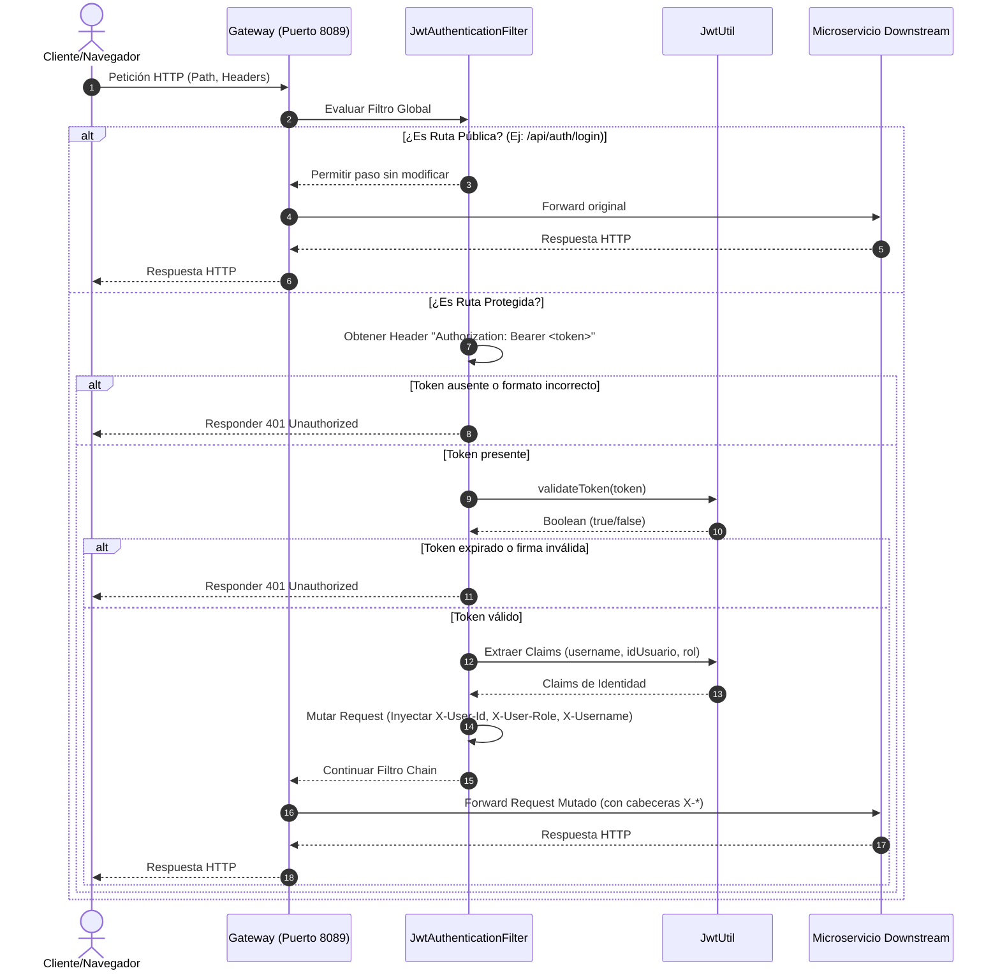

[← Volver al índice](INDEX.md)

# Arquitectura - Gateway de eduLLM

El Gateway de **eduLLM** se basa en **Spring Cloud Gateway**, un framework construido sobre Spring Boot y Project Reactor que proporciona un enrutamiento de APIs eficiente y no bloqueante.

## Diagrama de Flujo del Gateway

El siguiente diagrama ilustra el flujo de una petición entrante a través del Gateway y cómo interactúa con el filtro de autenticación y los microservicios downstream:

---

## Estructura de Módulos y Código

El código está estructurado en paquetes Java estándar de Spring Boot:

- **`com.edullm`**
  - [GatewayApplication.java](file:///home/gusgus/eclipse-workspace/Gateway/src/main/java/com/edullm/GatewayApplication.java): Clase principal que arranca la aplicación Spring Boot.
- **`com.edullm.gateway.filter`**
  - [JwtAuthenticationFilter.java](file:///home/gusgus/eclipse-workspace/Gateway/src/main/java/com/edullm/gateway/filter/JwtAuthenticationFilter.java): Filtro global que implementa `GlobalFilter` y `Ordered`. Intercepta todas las peticiones para la verificación de JWT.
- **`com.edullm.gateway.util`**
  - [JwtUtil.java](file:///home/gusgus/eclipse-workspace/Gateway/src/main/java/com/edullm/gateway/util/JwtUtil.java): Componente de utilidad encargado de interactuar con la biblioteca `io.jsonwebtoken` (JJWT) para verificar la expiración, firma y extraer los claims del token.

---

## Flujos Principales Detallados

### 1. Petición a Ruta Pública
- **Punto de Entrada:** Cualquier endpoint que empiece por alguna de las rutas en `PUBLIC_PATHS` de `JwtAuthenticationFilter`:
  - `/api/auth/login` (POST)
  - `/api/auth/forgot-password` (POST)
  - `/api/auth/reset-password`
  - `/login` (GET)
  - `/forgot-password` (GET)
  - `/reset-password` (GET)
- **Recorrido:**
  1. El cliente envía la solicitud al puerto `8089`.
  2. `JwtAuthenticationFilter` detecta que la ruta coincide con un prefijo público (`PUBLIC_PATHS.stream().anyMatch(path::startsWith)`).
  3. Llama a `chain.filter(exchange)` directamente, saltándose la lógica de verificación de token JWT.
  4. El enrutador de Spring Cloud Gateway reenvía la petición al microservicio mapeado en `application.yml` (por ejemplo, `auth-ms` en `http://localhost:8082`).
- **Entrada:** HTTP Request original.
- **Salida:** HTTP Response original del microservicio de destino.
- **Efectos Secundarios:** Ninguno.
- **Tablas de BD afectadas:** No se lee ni modifica ninguna BD directamente desde el Gateway (los servicios downstream gestionarán sus bases de datos correspondientes).

### 2. Petición a Ruta Protegida con Token Válido
- **Punto de Entrada:** Cualquier ruta no contenida en la lista pública, por ejemplo, `/api/rag/ask` o `/api/admin/users`.
- **Recorrido:**
  1. El cliente envía la petición con la cabecera `Authorization: Bearer <JWT>`.
  2. `JwtAuthenticationFilter` intercepta la petición, verifica que la ruta no es pública y lee la cabecera `Authorization`.
  3. Extrae el token (caracteres posteriores al índice 7).
  4. Llama a `jwtUtil.validateToken(token)`.
  5. Extrae los claims del token llamando a `jwtUtil.extractUsername(token)`, `jwtUtil.extractIdUsuario(token)` y `jwtUtil.extractRol(token)`.
  6. Crea un `ServerHttpRequest` mutado agregando las siguientes cabeceras HTTP:
     - `X-User-Id` (ID único del usuario extraído de `idUsuario`).
     - `X-User-Role` (Rol del usuario, ej: `ADMIN`, `STUDENT`).
     - `X-Username` (Nombre de usuario / Subject).
  7. Invoca `chain.filter` utilizando el exchange mutado.
  8. El Gateway enruta la petición mutada al microservicio configurado en `application.yml` (`ms-rag` o `ms-admin`).
- **Entrada:** HTTP Request con header `Authorization`.
- **Salida:** HTTP Response del microservicio downstream.
- **Efectos Secundarios:** Los microservicios internos reciben las cabeceras `X-User-Id`, `X-User-Role` y `X-Username` como prueba de identidad autenticada y autorizada por el Gateway.
- **Tablas de BD afectadas:** Ninguna en el Gateway.

### 3. Petición Protegida con Token Inválido o Ausente
- **Punto de Entrada:** Ruta protegida (ej: `/api/rag/history`) sin cabecera de autenticación o con un token alterado/expirado.
- **Recorrido:**
  1. El cliente realiza la solicitud al Gateway.
  2. `JwtAuthenticationFilter` intercepta la llamada.
  3. Al no encontrar cabecera `Authorization`, o si esta no empieza por `Bearer `, o si `jwtUtil.validateToken(token)` retorna `false` (o lanza una excepción de firma/expiración):
     - Establece el código de estado HTTP a `401 Unauthorized` (`exchange.getResponse().setStatusCode(HttpStatus.UNAUTHORIZED)`).
     - Termina la petición inmediatamente llamando a `exchange.getResponse().setComplete()`.
  4. El flujo de enrutamiento se detiene y no se llama al microservicio downstream.
- **Entrada:** HTTP Request sin token válido.
- **Salida:** HTTP Response con código `401 Unauthorized`.
- **Efectos Secundarios:** Ninguno. La petición no llega a los microservicios downstream.
- **Tablas de BD afectadas:** Ninguna.

---

## Decisiones Técnicas Clave

- **Arquitectura Reactive/Non-blocking:** Spring Cloud Gateway utiliza Netty y Project Reactor. Esto permite procesar un alto número de conexiones simultáneas con baja latencia y pocos recursos en comparación con arquitecturas tradicionales basadas en hilos por petición (como Spring Cloud Zuul 1.x o Spring MVC clásico).
- **Propagación de Identidad por Headers (`X-*`):** En lugar de que cada microservicio valide el token JWT independientemente contra la base de datos o descifre la firma repetidamente, el Gateway centraliza esta tarea. Si la solicitud pasa el Gateway, los microservicios asumen que el token es válido y confían en las cabeceras `X-User-Id`, `X-User-Role` y `X-Username` para aplicar reglas de negocio internas de autorización.
- **Precedencia del Filtro (`Order = -100`):** Al establecer un orden de `-100`, el filtro de seguridad se ejecuta antes de cualquier otro filtro de transformación o balanceo de carga de Spring Cloud Gateway, previniendo que peticiones no autorizadas consuman recursos de enrutamiento.

---

> **Nota para IA:** El uso de cabeceras mutadas `X-User-*` requiere que los microservicios downstream no acepten estas cabeceras directamente desde redes externas no controladas. El Gateway debe ser el único punto expuesto al exterior para evitar ataques de suplantación de identidad (Header Spoofing).

---

### Última revisión
- **Fecha:** 2026-05-25 01:20:13
- **Commit:** `364990c`

## Instrucciones para actualizar este doc
- Si cambia un flujo de petición, el orden del filtro o las rutas de enrutamiento → actualiza `ARCHITECTURE.md`.
- Si cambia la estructura de archivos → actualiza `INDEX.md`.
- Cuando completes un cambio relevante → añade línea en `CHANGELOG.md`.

[← Volver al índice](INDEX.md)
