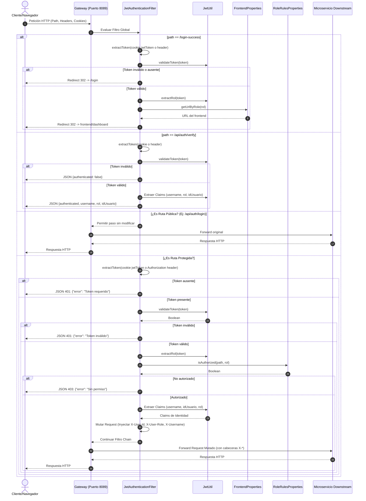

[← Volver al índice](INDEX.md)

# Arquitectura - Gateway de eduLLM

El Gateway de **eduLLM** se basa en **Spring Cloud Gateway**, un framework construido sobre Spring Boot y Project Reactor que proporciona un enrutamiento de APIs eficiente y no bloqueante.

## Diagrama de Flujo del Gateway

El siguiente diagrama ilustra el flujo de una petición entrante a través del Gateway y cómo interactúa con el filtro de autenticación y los microservicios downstream:



---

## Estructura de Módulos y Código

El código está estructurado en paquetes Java estándar de Spring Boot:

- **`com.edullm`**
  - [GatewayApplication.java](file:///home/gusgus/eclipse-workspace/Gateway/src/main/java/com/edullm/GatewayApplication.java): Clase principal que arranca la aplicación Spring Boot.
- **`com.edullm.gateway.filter`**
  - [JwtAuthenticationFilter.java](file:///home/gusgus/eclipse-workspace/Gateway/src/main/java/com/edullm/gateway/filter/JwtAuthenticationFilter.java): Filtro global que implementa `GlobalFilter` y `Ordered`. Intercepta todas las peticiones para la verificación de JWT, manejo de `login-success`, verificación de sesión y autorización por rol.
- **`com.edullm.gateway.util`**
  - [JwtUtil.java](file:///home/gusgus/eclipse-workspace/Gateway/src/main/java/com/edullm/gateway/util/JwtUtil.java): Componente de utilidad encargado de interactuar con la biblioteca `io.jsonwebtoken` (JJWT) para verificar la expiración, firma y extraer los claims del token.
  - [FrontendProperties.java](file:///home/gusgus/eclipse-workspace/Gateway/src/main/java/com/edullm/gateway/util/FrontendProperties.java): Configuración `@ConfigurationProperties(prefix = "app.frontend")` que mapea URLs de frontend por rol (`admin`, `professor`, `student`).
- **`com.edullm.rules`**
  - [RoleRulesProperties.java](file:///home/gusgus/eclipse-workspace/Gateway/src/main/java/com/edullm/rules/RoleRulesProperties.java): Configuración `@ConfigurationProperties(prefix = "gateway.security")` que define las reglas de autorización (paths permitidos por rol).

---

## Flujos Principales Detallados

### 1. Petición a Ruta Pública
- **Punto de Entrada:** Cualquier endpoint que empiece por alguna de las rutas en `PUBLIC_PATHS` de `JwtAuthenticationFilter`:
  - `/api/auth/login` (POST)
  - `/api/auth/forgot-password` (POST)
  - `/api/auth/reset-password`
  - `/login` (GET)
  - `/forgot-password` (GET)
  - `/reset-password` (GET)
- **Recorrido:**
  1. El cliente envía la solicitud al puerto `8089`.
  2. `JwtAuthenticationFilter` detecta que la ruta coincide con un prefijo público (`PUBLIC_PATHS.stream().anyMatch(path::startsWith)`).
  3. Llama a `chain.filter(exchange)` directamente, saltándose la lógica de verificación de token JWT.
  4. El enrutador de Spring Cloud Gateway reenvía la petición al microservicio mapeado en `application.yml` (por ejemplo, `auth-ms` en `http://localhost:8082`).
- **Entrada:** HTTP Request original.
- **Salida:** HTTP Response original del microservicio de destino.
- **Efectos Secundarios:** Ninguno.
- **Tablas de BD afectadas:** No se lee ni modifica ninguna BD directamente desde el Gateway (los servicios downstream gestionarán sus bases de datos correspondientes).

### 2. Petición a `/login-success` (Redirección Post-Login)
- **Punto de Entrada:** `GET /login-success`
- **Recorrido:**
   1. El navegador llega a esta ruta después de un login exitoso (con cookie `jwtToken`).
   2. `JwtAuthenticationFilter` detecta el path exacto y llama a `handleLoginSuccessAndRedirect()`.
   3. Extrae el token de la cookie `jwtToken` (o del header `Authorization` como fallback).
   4. Si el token es inválido o ausente, redirige (302) a `/login`.
   5. Si es válido, extrae el rol y consulta `FrontendProperties.getUrlByRole(rol)` para obtener la URL del frontend correspondiente.
   6. Redirige (302) a `<frontend-url>/dashboard`.
- **Entrada:** HTTP Request con cookie `jwtToken`.
- **Salida:** HTTP Redirect 302 al dashboard del frontend.
- **Tablas de BD afectadas:** Ninguna.

### 3. Petición a `/api/auth/verify` (Verificación de Sesión)
- **Punto de Entrada:** `GET /api/auth/verify`
- **Recorrido:**
   1. El frontend solicita verificar si la sesión está activa.
   2. `handleVerify()` extrae el token de cookie o header.
   3. Si es inválido, retorna `{"authenticated": false}` con `401 Unauthorized`.
   4. Si es válido, retorna `{"authenticated": true, "username": ..., "rol": ..., "idUsuario": ...}`.
- **Entrada:** HTTP Request con cookie `jwtToken` o header `Authorization`.
- **Salida:** JSON con estado de autenticación.
- **Tablas de BD afectadas:** Ninguna.

### 4. Petición a Ruta Protegida con Token Válido y Autorizado
- **Punto de Entrada:** Cualquier ruta no contenida en la lista pública, por ejemplo, `/api/rag/ask` o `/api/admin/users`.
- **Recorrido:**
   1. El cliente/envía la petición con cookie `jwtToken` o header `Authorization: Bearer <JWT>`.
   2. `handleProtectedRoute()` extrae el token mediante `extractToken()`.
   3. Valida el token con `jwtUtil.validateToken(token)`.
   4. Extrae el rol y verifica autorización con `isAuthorized(path, rol)` consultando `RoleRulesProperties`.
   5. Si el rol no tiene permiso, retorna `{"error": "Sin permiso"}` con `403 Forbidden`.
   6. Si autorizado, extrae los claims y muta la request con headers:
      - `X-User-Id` (ID único del usuario extraído de `idUsuario`).
      - `X-User-Role` (Rol del usuario, ej: `ADMIN`, `STUDENT`).
      - `X-Username` (Nombre de usuario / Subject).
   7. Invoca `chain.filter` utilizando el exchange mutado.
   8. El Gateway enruta la petición mutada al microservicio configurado en `application.yml`.
- **Entrada:** HTTP Request con cookie `jwtToken` o header `Authorization`.
- **Salida:** HTTP Response del microservicio downstream.
- **Efectos Secundarios:** Los microservicios internos reciben las cabeceras `X-User-Id`, `X-User-Role` y `X-Username` como prueba de identidad autenticada y autorizada por el Gateway.
- **Tablas de BD afectadas:** Ninguna en el Gateway.

### 5. Petición Protegida con Token Inválido, Ausente o No Autorizado
- **Punto de Entrada:** Ruta protegida (ej: `/api/rag/history`) sin token válido o sin permisos de rol suficientes.
- **Recorrido:**
   1. El cliente realiza la solicitud al Gateway.
   2. `handleProtectedRoute()` intercepta la llamada.
   3. Si el token no se encuentra: retorna `{"error": "Token requerido"}` (`401`).
   4. Si el token es inválido/expirado: retorna `{"error": "Token inválido"}` (`401`).
   5. Si el token es válido pero el rol no tiene permiso para la ruta: retorna `{"error": "Sin permiso"}` (`403`).
   6. El flujo de enrutamiento se detiene y no se llama al microservicio downstream.
- **Entrada:** HTTP Request sin token válido o sin permisos.
- **Salida:** HTTP Response con JSON de error (`401` o `403`).
- **Efectos Secundarios:** Ninguno. La petición no llega a los microservicios downstream.
- **Tablas de BD afectadas:** Ninguna.

---

## WebSocket / Socket.IO

El Gateway **no necesita un filtro adicional** para manejar WebSocket. Spring Cloud Gateway soporta WebSocket nativamente:

1. Socket.IO comienza con **HTTP polling** (`/game/socket.io/?transport=polling` o `/socket.io/?transport=polling`) — el `JwtAuthenticationFilter` lo intercepta como cualquier petición HTTP, valida el token, y lo enruta al microservicio.
2. Luego intenta **upgrade a WebSocket** (`Upgrade: websocket`) — Spring Cloud Gateway maneja el handshake de upgrade automáticamente, sin necesidad de configuración extra.

Existen **dos rutas de Socket.IO** que el Gateway enruta a diferentes backends:

| Ruta | Backend | Uso |
|---|---|---|
| `/socket.io/**` | `http://prompting-ms:8000` | Tutor virtual (alumno) |
| `/game/socket.io/**` | `http://ms-profesor:8082` | Juego en vivo (profesor y estudiante) |

**Configuración de rutas en `application.yml`:**

```yaml
- id: ms-prompting
  uri: http://prompting-ms:8000
  predicates:
    - Path=/tutor/**, /socket.io/**, /quiz, /api/quiz/**, /api/generate-quiz

- id: ms-profesor
  uri: http://ms-profesor:8082
  predicates:
    - Path=/api/profesor/**, /api/profesor/dashboard/**, /api/profesor/cuestionarios/**, /api/profesor/partidas/**, /api/profesor/materias/**, /game/socket.io/**
```

**Reglas de autorización por rol:** el `JwtAuthenticationFilter` valida que el rol tenga permiso para el path:

- `ROLE_ESTUDIANTE` y `ROLE_PROFESOR` tienen acceso a `/game/socket.io/**`
- `ROLE_ADMINISTRADOR` tiene acceso a `/socket.io/**`

Para WebSocket upgrade, el navegador envía la cookie `jwtToken` automáticamente (mismo origen), por lo que no se requiere lógica adicional.

## Decisiones Técnicas Clave

- **Arquitectura Reactive/Non-blocking:** Spring Cloud Gateway utiliza Netty y Project Reactor. Esto permite procesar un alto número de conexiones simultáneas con baja latencia y pocos recursos en comparación con arquitecturas tradicionales basadas en hilos por petición (como Spring Cloud Zuul 1.x o Spring MVC clásico).
- **Propagación de Identidad por Headers (`X-*`):** En lugar de que cada microservicio valide el token JWT independientemente contra la base de datos o descifre la firma repetidamente, el Gateway centraliza esta tarea. Si la solicitud pasa el Gateway, los microservicios asumen que el token es válido y confían en las cabeceras `X-User-Id`, `X-User-Role` y `X-Username` para aplicar reglas de negocio internas de autorización.
- **Precedencia del Filtro (`Order = -100`):** Al establecer un orden de `-100`, el filtro de seguridad se ejecuta antes de cualquier otro filtro de transformación o balanceo de carga de Spring Cloud Gateway, previniendo que peticiones no autorizadas consuman recursos de enrutamiento.
- **RBAC (Role-Based Access Control):** El Gateway ahora valida autorización por rol mediante `RoleRulesProperties`, que define qué paths puede acceder cada rol. Esto centraliza las reglas de acceso en lugar de delegarlas a cada microservicio.
- **Extracción de Token desde Cookie:** El filtro soporta extraer el JWT desde la cookie `jwtToken` (para peticiones de navegador) con fallback al header `Authorization: Bearer`, permitiendo que el frontend trabaje con cookies HttpOnly.

---

> **Nota para IA:** El uso de cabeceras mutadas `X-User-*` requiere que los microservicios downstream no acepten estas cabeceras directamente desde redes externas no controladas. El Gateway debe ser el único punto expuesto al exterior para evitar ataques de suplantación de identidad (Header Spoofing).

---

### Última revisión
- **Fecha:** 2026-05-30
- **Commit:** `HEAD` (cambios sin commit)

## Instrucciones para actualizar este doc
- Si cambia un flujo de petición, el orden del filtro o las rutas de enrutamiento → actualiza `ARCHITECTURE.md`.
- Si cambia la estructura de archivos → actualiza `INDEX.md`.
- Cuando completes un cambio relevante → añade línea en `CHANGELOG.md`.

[← Volver al índice](INDEX.md)
