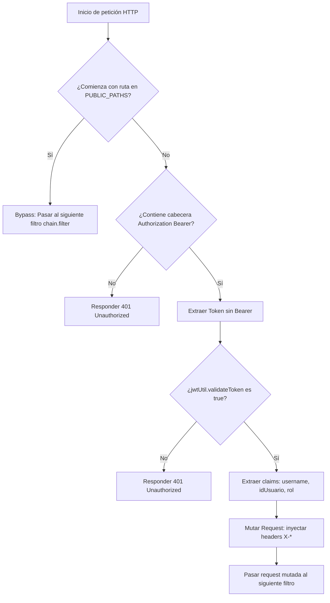

[← Volver al índice](INDEX.md)

# Servicios Internos - Gateway de eduLLM

El Gateway se organiza en torno a dos componentes de lógica interna para la gestión de seguridad y autenticación. A continuación, se detallan sus propósitos, métodos públicos e implementación técnica.

---

## 1. Filtro Global: `JwtAuthenticationFilter`

El componente [JwtAuthenticationFilter](file:///home/gusgus/eclipse-workspace/Gateway/src/main/java/com/edullm/gateway/filter/JwtAuthenticationFilter.java) es un filtro de red global reactivo que intercepta todas las solicitudes entrantes al Gateway. Su objetivo principal es actuar como una barrera de seguridad de pre-autenticación.

- **Tipo:** `@Component` de Spring. Implementa `GlobalFilter` y `Ordered`.
- **Precedencia (`getOrder()`):** Retorna `-100`. Se ejecuta antes que los filtros de enrutamiento y balanceo de carga para denegar peticiones no autorizadas de forma inmediata.
- **Dependencias inyectadas:**
  - `JwtUtil`: Utilidad criptográfica y descodificadora del token.

### Lógica de Filtrado (`filter(ServerWebExchange, GatewayFilterChain)`)

### Rutas Públicas Excluidas (`PUBLIC_PATHS`)
El filtro define una lista interna de rutas que no requieren comprobación de token:
- `/api/auth/login` (POST)
- `/api/auth/forgot-password` (POST)
- `/api/auth/reset-password`
- `/login` (GET)
- `/forgot-password` (GET)
- `/reset-password` (GET)

---

## 2. Utilidad Criptográfica: `JwtUtil`

El componente [JwtUtil](file:///home/gusgus/eclipse-workspace/Gateway/src/main/java/com/edullm/gateway/util/JwtUtil.java) encapsula las operaciones criptográficas sobre los JSON Web Tokens utilizando la biblioteca Java JWT (JJWT).

- **Tipo:** `@Component` de Spring.
- **Propiedades configuradas:**
  - `${jwt.secret}`: Secreto hexadecimal inyectado desde `application.yml`.

### Métodos Principales

| Método | Retorno | Parámetros | Descripción |
|---|---|---|---|
| `validateToken(token)` | `boolean` | `String token` | Valida que la firma sea íntegra y que el token no haya expirado. Retorna `false` ante cualquier excepción de firma o parseo. |
| `extractUsername(token)` | `String` | `String token` | Extrae el Subject (`sub`) del token JWT. |
| `extractIdUsuario(token)` | `Long` | `String token` | Extrae la propiedad personalizada `idUsuario` desde los claims. |
| `extractRol(token)` | `String` | `String token` | Extrae la propiedad personalizada `rol` (rol del usuario, ej: `ADMIN`, `STUDENT`) desde los claims. |
| `isTokenExpired(token)` | `boolean` | `String token` | Compara el claim de expiración (`exp`) con la fecha actual del sistema. |
| `extractAllClaims(token)` | `Claims` | `String token` | Método privado que realiza el parseo de la firma del token utilizando la clave secreta generada en `getSignKey()`. |
| `getSignKey()` | `SecretKey` | Ninguno | Método privado que convierte el String hexadecimal de `jwt.secret` en bytes `UTF_8` y construye la llave criptográfica mediante `Keys.hmacShaKeyFor()`. |

---

> **Nota para IA:** Si necesitas extender los datos del usuario que se propagan a los microservicios downstream, primero debes asegurar que dichos claims (ej. `email`, `organización`) estén incluidos en el JWT generado por `auth-ms`. Luego, puedes añadir un método extractor en `JwtUtil.java` e inyectar la cabecera correspondiente en `JwtAuthenticationFilter.java`.

---

### Última revisión
- **Fecha:** 2026-05-25 01:20:13
- **Commit:** `364990c`

## Instrucciones para actualizar este doc
- Si añades o modificas servicios internos, filtros globales o clases de utilidad → actualiza `SERVICES.md`.
- Si cambia un flujo de enrutamiento → actualiza `ARCHITECTURE.md`.
- Si cambia la estructura de archivos → actualiza `INDEX.md`.
- Cuando completes un cambio relevante → añade línea en `CHANGELOG.md`.

[← Volver al índice](INDEX.md)
